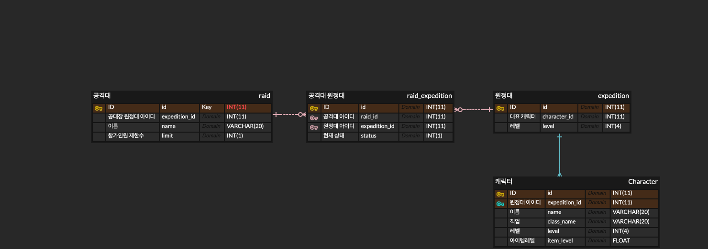

# RaidLoa
***

## 프로젝트 소개
공격대에 참여한 사람들의 원활한 파티 구성을 돕기 위한 프로젝트 입니다
***
## 테이블 ERD

***

## API 명세

### Raid
- GET /raids 현재 존재하는 공격대 목록
- GET /raids/{id} 현재 공격대의 상세 정보 표시
- GET /raids/{id}/expeditions 현재 공격대의 원정대 목록을 표시
- POST /user/raids 공격대를 생성
- PUT /user/raids/{id} 공격대 정보를 수정
- DELETE /user/raids/{id}/expeditions/{id} 공격대에서 특정 원정대 제외
- DELETE /user/raids/{id} 공격대 삭제

### Expedition
- GET /expeditions 현재 존재하는 원정대 목록
- GET /expeditions/{id} 원정대 정보를 표시
- POST /user/expedition/raids/{id} 공격대 가입
- DELETE /user/expedition/raids/{id} 공격대 탈퇴

### Character
- GET /characters 현재 존재하는 캐릭터 목록
- GET /characters/{class_name} 특정 클래스 캐릭터 목록
- GET /characters/{character_name} 캐릭터 상세 정보 표시

***